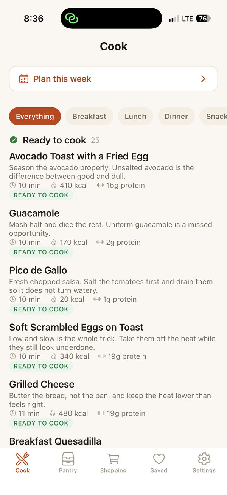
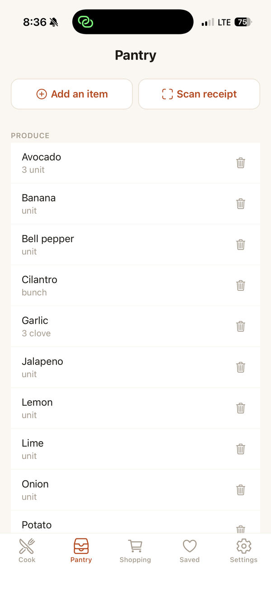
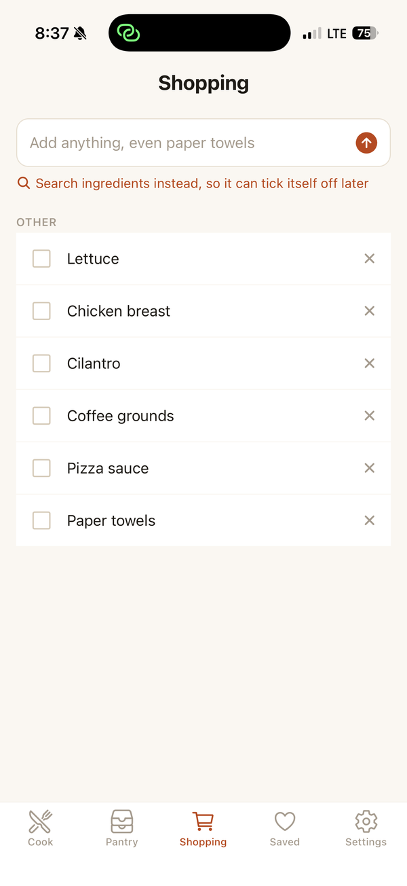
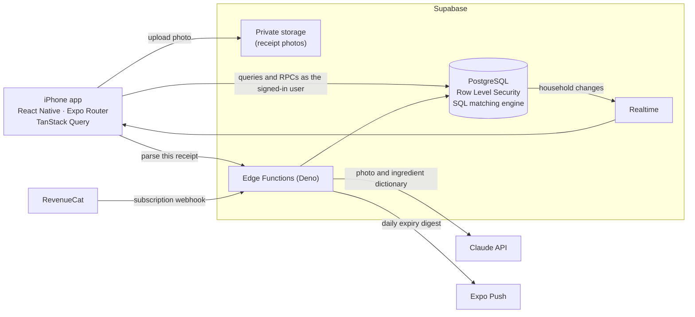

# Shelfsmith

An iPhone app that knows what food you have and tells you what you can cook
with it.

Scan a grocery receipt and what you bought lands in a pantry shared with
everyone in your household. Open the app and you see the dishes you can make
right now, the ones you are one or two items short of, and which of them use
up food that is about to go off.

**Status:** in TestFlight beta · **Role:** solo developer · **Built:** 2026 ·
**Stack:** TypeScript, React Native, Expo, PostgreSQL, Supabase, Claude API

> The source code is in a private repository while the app is in beta. I'm
> glad to walk through it or share access. Email
> [lindellrhett@gmail.com](mailto:lindellrhett@gmail.com).
> This repository hosts the app's public [support and legal pages](#this-repository).

<table>
  <tr>
    <td align="center"><br><sub><b>Cook:</b> what you can make right now</sub></td>
    <td align="center"><br><sub><b>Pantry:</b> shared by the household</sub></td>
    <td align="center"><br><sub><b>Shopping:</b> live across every phone</sub></td>
  </tr>
</table>

---

## What it does

- **Receipt scanning.** Photograph a receipt and an AI model reads each line,
  matched against a dictionary of 255 ingredients. You review every line before
  anything reaches the pantry.
- **"What can I cook?"** 317 recipes across 22 cuisines, each with calories and
  macros, split into *Ready to cook* and *Almost there*.
- **Ingredient swaps.** A recipe that calls for corn tortillas still counts as
  ready when you have flour tortillas, and the app tells you which swap it
  used. There are 110 swap pairs, and none of them is offered if it would break
  your diet or contain your allergen.
- **Shared households.** Join with a six-character invite code. Everyone sees
  the same pantry and shopping list, updated live on every phone.
- **Personal filters.** Diets, allergies, dislikes and a cooking-time limit are
  set per person, because two people can share a kitchen without sharing a diet.
- **Expiry tracking.** Estimated use-by dates for each item, a "Use soon" list,
  and recipes that use up those items rank higher.
- **Weekly meal planner.** Plan the week together, then build one shopping
  list for all of it without listing the same item twice.
- **Shelfsmith Plus**, a subscription that unlocks scanning, planning and
  reminders for the whole household.

## Architecture



The app talks to Postgres directly and Row Level Security decides what each
user can see. The only code that holds secrets (the Claude API key and the
service role) runs in Edge Functions on the server.

## Engineering highlights

**Recipe matching is one SQL function.** `match_recipes` joins every recipe
against the household's pantry and returns, for each recipe, what is missing,
which swaps it relies on, and which expiring items it uses up. It never lets a
garnish block a match, treats salt and oil as present unless the household
says otherwise, hides anything containing the user's allergen, and ranks by
missing count, then by expiring items used, favourites, dislikes and what was
cooked recently.

**Swaps respect diets, per person.** Swaps are worked out for whoever is
asking. Flour tortillas stand in for corn for most people, but not for someone
eating gluten-free, whose screen correctly shows the recipe as one item short.
Swaps never chain, and the choice of stand-in is deterministic so the recipe
page does not name a different one on every load:

```sql
-- One stand-in per missing ingredient, filtered by the caller's own settings.
select distinct on (s.ingredient_id) s.ingredient_id, s.substitute_id
from ingredient_substitutes s
join have h on h.ingredient_id = s.substitute_id
join ingredients sub on sub.id = s.substitute_id
cross join prefs p
where s.ingredient_id not in (select ingredient_id from have)
  and not (s.substitute_id = any(p.allergens))
  and not (s.blocked_for_diets && p.diets)
order by s.ingredient_id, sub.display_name
```

**Diet labels are derived, not typed.** Each ingredient records which diets it
conflicts with, and the seed script computes every recipe's labels from its
required ingredients. It also rejects any recipe whose stated calories are more
than 20% off what its protein, carbs and fat add up to. With 317 recipes,
hand-typed labels would drift, and a wrong "gluten-free" label is a real harm.

**Household isolation.** Every household table checks membership through a
single `is_household_member` function. Joining a household goes through a
`SECURITY DEFINER` function, so nobody can list households they do not belong
to.

**The AI key never reaches the phone.** Anything in an app bundle can be read
by whoever installs it. Receipt photos go to a private bucket, and a server
function checks the caller, their consent and their subscription before
sending the image to Claude. The photo is deleted as soon as it has been read,
whether parsing worked or not.

**AI cost measured, not guessed.** I measured the real payload, moved to a
smaller model and removed a prompt cache that was never reused. Together those
cut the cost per scan by about 60%, to roughly 3 cents. The model can be
smaller because a person reviews every line anyway, so a misread costs one tap
to fix rather than a wrong pantry.

**Entitlements the app cannot fake.** Only a webhook authenticated with a
shared secret can write subscription status, and it ignores repeated events.
The database decides who has Plus, so a modified app still cannot unlock it.

**Database tests without Docker.** The test harness loads all 14 migrations
into PGlite (Postgres compiled to WebAssembly) and runs as different signed-in
users to check the access rules. For example, a non-member cannot see what a
household has expiring, a housemate cannot read the payer's subscription, and
deleting an account hands the household to the next member instead of wiping
it. That is 106 checks across 8 suites.

## Privacy and compliance

I treated the legal requirements as engineering requirements and enforced them
in the database, so a modified app cannot get around them.

- **Apple 5.1.2(i), third-party AI.** An explicit consent sheet appears before
  the first scan. The server refuses to scan without that consent on record.
- **Washington My Health My Data Act and UK GDPR.** Allergies and diets count
  as health data, so they need separate opt-in consent. Withdrawing it clears
  them.
- **Apple 5.1.1(v), account deletion.** You can delete your account inside the
  app. It removes your personal data while keeping the shared household intact
  for everyone else.
- **Data minimization.** Receipt photos are deleted as soon as they have been
  read, and scan records are purged after 90 days.
- **Policies.** I drafted a privacy policy, a consumer health data policy and
  terms for the US, UK, Canada and Australia, with a brief for legal review.

## By the numbers

| | |
|---|---|
| Recipes | 317, across 22 cuisines |
| Ingredients in the dictionary | 255, with receipt aliases and shelf lives |
| Ingredient swaps | 110 |
| Database migrations | 14 |
| Edge Functions | 4: receipt parsing, account deletion, subscription webhook, expiry reminders |
| Database test checks | 106 across 8 suites, all passing |
| Screens | 16 |

## My role

I built Shelfsmith on my own:

- **Product and design:** chose the features and designed the screens.
- **Backend:** designed the Postgres schema and the matching engine, wrote the
  Row Level Security policies, and built the Edge Functions.
- **AI integration:** built receipt scanning, including the review flow and the
  cost work.
- **Data:** built the recipe library and the validator that checks it.
- **Launch:** set up the privacy and consent design, subscriptions, and the
  build and release pipeline to TestFlight.

Claude Code was one of the tools I used during development. I owned the
architecture and data design, and led debugging and testing.

## This repository

This repository serves the app's public pages through GitHub Pages: the
[support page](https://lindellrhett-gif.github.io/shelfsmith/site/),
[Privacy Policy](https://lindellrhett-gif.github.io/shelfsmith/site/privacy.html),
[Consumer Health Data Privacy Policy](https://lindellrhett-gif.github.io/shelfsmith/site/health-data.html)
and [Terms](https://lindellrhett-gif.github.io/shelfsmith/site/terms.html). They
are plain HTML and CSS in [`site/`](site).

**More:** [Portfolio](https://lindellrhett-gif.github.io/) ·
[Project page](https://lindellrhett-gif.github.io/shelfsmith.html) ·
[GitHub](https://github.com/lindellrhett-gif)
